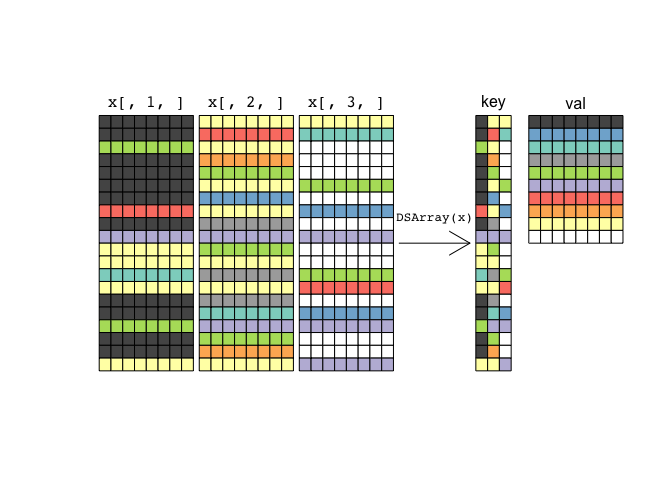

<!-- README.md is generated from README.Rmd. Please edit that file -->
[](http://www.repostatus.org/#wip) [](https://travis-ci.org/PeteHaitch/DSArray) [](https://ci.appveyor.com/project/PeteHaitch/DSArray) [](https://codecov.io/github/PeteHaitch/DSArray?branch=master)

<!-- TODO: Uncomment once in Bioc
[](http://bioconductor.org/packages/stats/bioc/DSArray.html) -->
<!-- TODO: Uncomment once obtained DOI
[](https://zenodo.org/badge/latestdoi/22085/PeteHaitch/DSArray) -->
<!-- TODO: Uncomment once in Bioc
[](http://bioconductor.org/checkResults/devel/bioc-LATEST/DSArray/) -->
R package: DSArray
------------------

**DSArray** ("*desiree*") provides efficient in-memory representation of 3-dimensional arrays that contain many duplicate slices via the *DSArray* (**D**uplicate **S**lice **Array**) S4 class. A basic array-like API is provided for instantiating, subsetting, and combining DSArray objects.

Installation
------------

You can get the development version from GitHub:

``` r
devtools::install_github("PeteHaitch/DSArray")
```

What the hell do I do with this?
--------------------------------

This package serves a niche purpose. However, since I've found it useful, I'm making it publicly available. Here is the problem in words and a picture illustrating the solution that **DSArray** offers.

Suppose you have data on a set of `n` samples where each sample's data can be represented as a matrix (`x1`, ..., `xn`) where `dim(x1) = ... = dim(xn) = c(nrow, ncol)`. We can combine these matrices along a given dimension to form a 3-dimensional array, `x`. **DSArray** is designed for the special case where there are many duplicate *slices* of `x`. Continuing our example, if each of the `x1`, ..., `xn` have duplicate rows and we combine `x1`, ..., `xn` to form `x` such that `x[, j, ]` represents `xj`, then for this special case we can efficiently represent the data by storing only the unique rows of the `x1`, ..., `xn` and an associated index. A picture will hopefully help make this clearer:



In this example we have `n = 3` matrices, each shown as a slice of `x` (`x[, 1, ]`, `x[, 2, ]`, `x[, 3, ]`) with `nrow = 20` and `ncol = 8`, where the colour of the row identifies identical rows. Note that the same row may be found multiple times within a sample and may also be common to multiple samples. We can construct the *DSArray* representation of `x` by calling `DSArray(x)`. The *DSArray* representation has a *key* and a *val*, much like an associative array, map, or dictionary. The j-th column of the *key* is the key for the j-th sample (note the colour ordering of each sample). The *val* contains all **unique** rows found in the `n` samples.

We can reconstruct the data for a particular sample by expanding the *val* by the relevant column of the *key*. We can often compute the required summaries of the data while retaining this sparse representation. In this way, a *DSArray* is similar to using a run length encoding of a vector or a sparse matrix representation to leverage the additional structure in the object.

<!-- TODO: Uncomment once implemented
### Memory usage


```r
# TODO: Plot of memory savings for different nr, nc, sl, pus, and so
```
-->
### API and overview of methods

The aim is to allow a *DSArray* to be used as a drop-in replacement for an *array* from the **base** package when the need arises. The *DSArray* API is therefore written to mimic the *array* API so that *DSArray* objects behave as if they were 3-dimensional *array* objects.

Quick demo
----------

<!-- TODO: Uncomment once implemented
Here we use a small example dataset to demonstrate the API. However, it is only really beneficial to use a _DSArray_ object instead of an _array_ when the dimensions of the object are large and there are many duplicate slices (this is demonstrated at the end of the demo).


-->
**DSArray** includes extensive documentation available through the R help system:

``` r
# See all documentation for the package
help(package = "DSArray")
# See documentation for the DSArray class
?`DSArray-class`
```

<!-- TODO: Uncomment once the package is part of Bioconductor
The package also includes a comprehensive vignette that expands upon the above quick demo. In particular, the vignette demonstrates:

1. Using _DSArray_ objects with the [__SummarizedExperiment__](http://bioconductor.org/packages/SummarizedExperiment/) R/Bioconductor package. 
2. A discussion of optimally implemented methods for _DSArray_ objects
3. Comparison to the sparse matrix classes in the __Matrix__ (TODO: Get official CRAN link) R pakage.
4. Future work

The first point was the motivation for the development of __DSArray__. The __SummarizedExperiment__ package defines an important base class in the Bioconductor project. I needed an efficient way to store DNA methylation patterns, a particular kind of genomic data, that was compatible with the __SummarizedExperiment__ package.

The vignette can be viewed at [http://bioconductor.org/packages/release/bioc/vignettes/DSArray/inst/doc/DSArrayIntroduction.html](http://bioconductor.org/packages/release/bioc/vignettes/DSArray/inst/doc/DSArrayIntroduction.html) or accessed from R using: -->
Have a feature request, need help or want to get involved?
----------------------------------------------------------

While **DSArray** implements many methods that allow *DSArray* objects to be used as drop-in replacements for *array* objects, the coverage is not 100% complete. I am adding these as needed, so if something you require is missing then please get in touch by filing a feature request at <https://github.com/PeteHaitch/DSArray/issues>.

<!-- TODO: Uncomment once part of Bioconductor
I recommend that questions seeking support in using the software are posted to the Bioconductor support forum - [https://support.bioconductor.org/](https://support.bioconductor.org/) - where they will attract not only my attention but that of the wider Bioconductor community. -->
Of course, code contributions and bug reports (and fixes!) are most welcome. Please make any pull requests against the master branch at <https://github.com/PeteHaitch/DSArray> and file issues at <https://github.com/PeteHaitch/DSArray/issues>.
